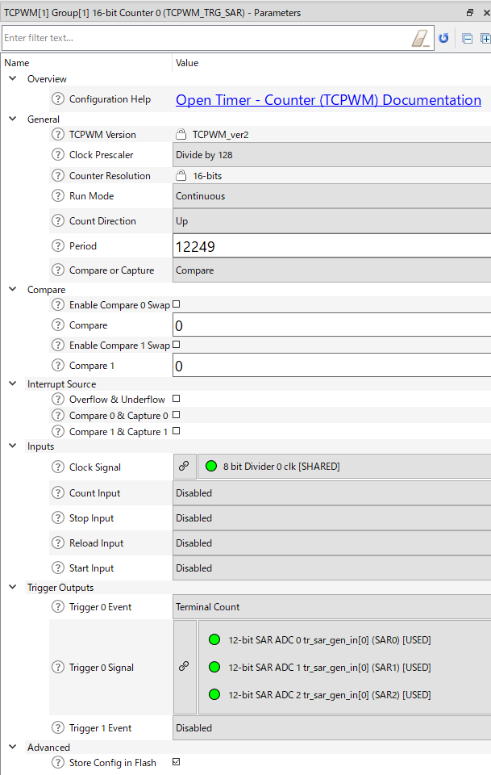
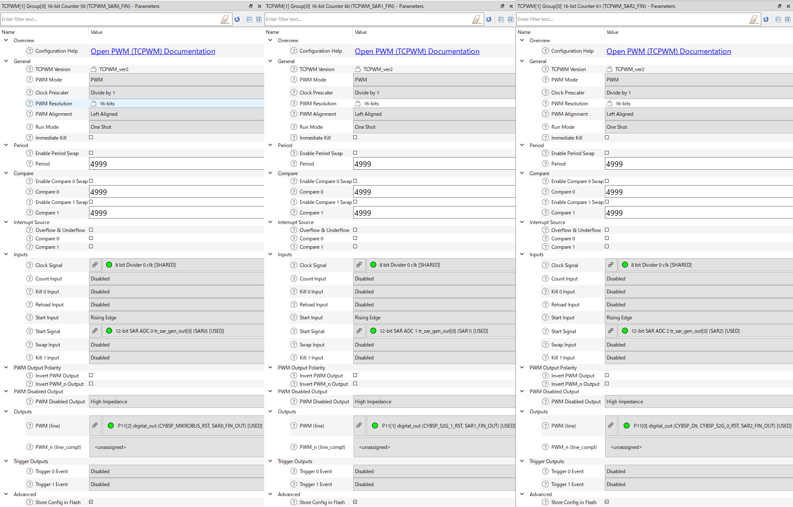
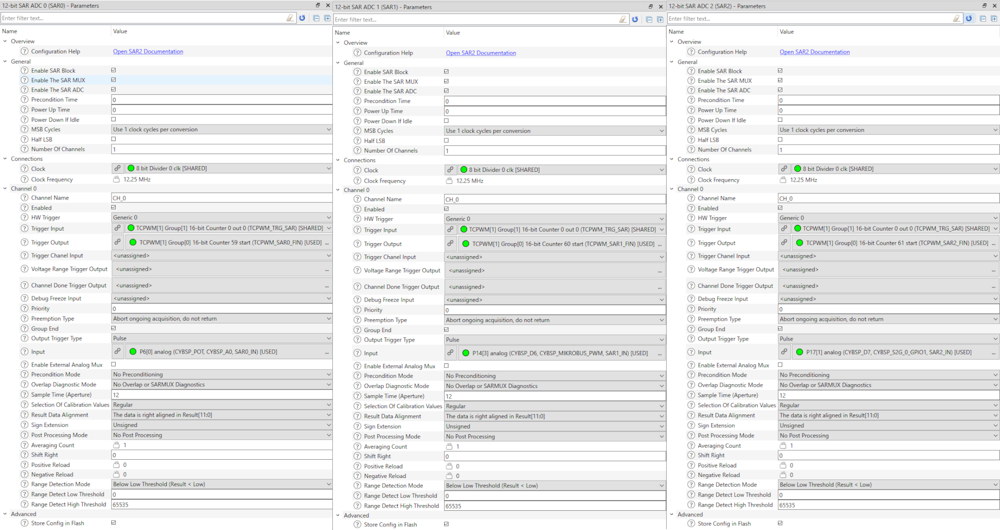
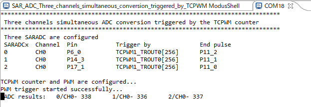

# SAR ADC Three channels simultaneous conversion triggered by TCPWM

**This code example demonstrates how to convert multiple SAR ADC (Successive Approximation Register Analog-to-Digital Converter) channels simultaneously by triggering the TCPWM (Timer, Counter and PWM) counter.**

## Device

The device used in this code example (CE) is:

- [TRAVEO™ T2G CYT4BF Series](https://www.infineon.com/cms/en/product/microcontroller/32-bit-traveo-t2g-arm-cortex-microcontroller/32-bit-traveo-t2g-arm-cortex-for-body/traveo-t2g-cyt4bf-series/)

## Board

The board used for testing is:

- TRAVEO™ T2G evaluation kit ([KIT_T2G-B-H_LITE](https://www.infineon.com/cms/en/product/evaluation-boards/kit_t2g-b-h_lite/))

## Scope of work

In this example, three SAR-ADC channels ADC[0]_0, ADC[1]_0 and ADC[2]_0 are configured to get trigger from the TCPWM counter. The trigger from the TCPWM counter is connected in parallel to the SAR sequencer of each channel using trigger multiplexer. All the ADC conversion of each channel will start simultaneously as soon as the counter reaches its terminal count.

## Introduction  

**SAR ADC**

The analog block contains three 1-Msps SAR ADCs. These ADCs can be clocked at up to 26.67 MHz and provide a 12-bit resolution 26 clock cycles. The references for all three SAR ADCs come from a dedicated pair of inputs: VREFH and VREFL.

Each ADC has a sequencer, which autonomously cycles through the configured channels (sequencer scan) with zero-switching overhead (that is, the aggregate sampling bandwidth, when clocked at 26.67 MHz, is equal to 1Msps whether it is for a single channel or distributed over several channels). The sequencer switching is controlled through a state machine or firmware. The sequencer prioritizes trigger requests, enables the appropriate analog channel, controls ADC sampling, initiates ADC data conversion, manages results, and initiates subsequent conversions for repetitive or group conversions without CPU intervention.
 
- Three SAR A/D converters with up to 99 external channels (96 I/Os + 3 I/Os for motor control)
    - Each ADC supports 32 logical channels, with 32 + 1 physical connections. Any external channel can be any logical channel
- Each ADC supports 12-bit resolution and sampling rates of up to 1 Msps
- Each ADC also supports six internal analog inputs like
    - Bandgap reference to establish absolute voltage levels
    - Calibrated diode for junction temperature calculations
    - Two AMUXBUS inputs and two direct connections to monitor supply levels
    - Each ADC supports addressing of external multiplexers
    - Each ADC has a sequencer supporting autonomous scanning of configured channels
    - Synchronized sampling of all ADCs for motor-sense applications

**TCPWM**

The TCPWM block consists of 16-bit (102 channels) and 32-bit (16 channels) counters with user-programmable period. Fifteen of the 16-bit counters are optimized for motor-control operations. Each TCPWM counter contains a capture register to record the count at the time of an event, a period register (used to either stop or auto-reload the counter when its count is equal to the period register), and compare registers to generate signals that are used as PWM duty-cycle outputs.
 
- Up to 102 16-bit and 16 32-bit Timer/Counter Pulse-Width Modulator (TCPWM) blocks
    - Up to 15 16-bit counters for motor control
    - Up to 87 16-bit counters and 16 32-bit counters for regular operations
    - Supports timer, capture, quadrature decoding, pulse-width modulation (PWM), PWM with dead time (PWM_DT), pseudo-random PWM (PWM_PR), and shift-register (SR) modes.

**Trigger Multiplexer**

The Trigger Multiplexer supports connecting various peripherals using trigger signals. Triggers are used to inform a peripheral of the occurrence of an event or change of state. These triggers are used to affect or initiate some action in other peripherals. The trigger multiplexer is used to route triggers from a source peripheral to a destination. Triggers provide active logic functionality and are typically supported in Active mode.

- Ability to connect any trigger signal from one peripheral to another
- Provides up to 16 multiplexer-based trigger groups and up to 16 one-to-one trigger groups
- Supports a software trigger, which can trigger any signal in the block
- Ability to configure a trigger multiplexer with trigger manipulation features in hardware such as inversion and edge/level detection

More details can be found in [Technical Reference Manual (TRM)](https://www.infineon.com/dgdl/?fileId=5546d4627600a6bc017600bfae720007), [Registers TRM](https://www.infineon.com/dgdl/?fileId=5546d4627600a6bc017600be2aef0004) and [Data Sheet](https://www.infineon.com/dgdl/?fileId=5546d46275b79adb0175dc8387f93228).

## Hardware setup

This CE has been developed for:

- TRAVEO™ T2G Body High Lite evaluation kit ([KIT_T2G-B-H_LITE](https://www.infineon.com/cms/en/product/evaluation-boards/kit_t2g-b-h_lite/)) 
 

- All the signals are input/output from the following pins respectively:
  <table border="1" style="border-collapse: collapse">
  <thead><tr>
  <th>Kit</th><th>Channel</th><th>Port Pin</th><th>Trigger by</th><th>End Pulse</th></tr></thead>
  <tr><td rowspan="3"><code>KIT_T2G-B-H_LITE</code></td><td>ADC[0]_0</td><td>P6[0]</td><td>TCPWM1_TROUT1[256]</td><td>P11[2]</td></tr>
  <tr><td>ADC[1]_0</td><td>P14[3]</td><td>TCPWM1_TROUT1[256]</td><td>P11[1]</td></tr>
  <tr><td>ADC[2]_0</td><td>P17[1]</td><td>TCPWM1_TROUT1[256]</td><td>P11[0]</td></tr>
  </table>

## Implementation

**TCPWM counter/PWM configuration**

- **TCPWM counter** 
  The TCPWM counter named *TCPWM_TRG_SAR* is configured by Device Configurator to produce a trigger output when it reaches to the terminal count. The counter is set to run continuously with period of 128ms.:
   
- **TCPWM PWM** 
  The three TCPWM PWM channels named *TCPWM_SAR0_FIN*, *TCPWM_SAR1_FIN* and *TCPWM_SAR2_FIN* respectively is set by the Device Configurator to indicate the completion of conversion for each of the three ADC channels. These channels are set to produce one-shot 400us pulse and to be triggered by SAR ADC on its conversion completion:
   
- **Initialize and enable the TCPWM**
    - The configuration of all the TCPWM channels used in this example are done in *InitAllTcpwm()* function.
    - Configurations are output from Device Configurator as a structure with each name followed by *_config*.
    - Initialization of the TCPWM PWM is done once in the <a href="https://infineon.github.io/mtb-pdl-cat1/pdl_api_reference_manual/html/group__group__tcpwm__functions__pwm.html#ga6440d2a9dc8d85056abd62556bee7f82"><i>Cy_TCPWM_PWM_Init()</i></a> function with the configured structure
    - Initialization of the TCPWM counter is done once in the <a href="https://infineon.github.io/mtb-pdl-cat1/pdl_api_reference_manual/html/group__group__tcpwm__functions__counter.html#ga6068a06ddc8a07c67bb6df86e920944c"><i>Cy_TCPWM_Counter_Init()</i></a> function with the configured structure as well
    - Then all the TCPWM are enabled in the <a href="https://infineon.github.io/mtb-pdl-cat1/pdl_api_reference_manual/html/group__group__tcpwm__functions__pwm.html#ga802ebf3a49b1056e4bc5b057deb26e49"><i>Cy_TCPWM_PWM_Enable()</i></a> function
- **Start the TCPWM counter**
    - The TCPWM counter is triggered in *TriggerCounterForConversion()* function using <a href="https://infineon.github.io/mtb-pdl-cat1/pdl_api_reference_manual/html/group__group__tcpwm__functions__common.html#gaafe86ec440bec9a2c23392f289cc3a8b"><i>Cy_TCPWM_TriggerStart_Single()</i></a> to trigger three SAR ADC channels periodically

**SAR ADC**

In this design, the three channels of the SAR ADC are enabled and configured to measure input voltage available at the ADC pins. The ADC conversion starts based on the trigger inputs, which is triggered by the TCPWM counter:
  

- **Trigger Multiplexer configuration**
    - Each ADC channels is triggered by the TCPWM counter using the trigger multiplexer configuration. Also, the conversion completion of each the SAR ADC channels are connected to trigger the TCPWM PWM channels, like shown in the picture above.
    - The configuration are set by calling *cybsp_init()* which includes PDL function call of <a href="https://infineon.github.io/mtb-pdl-cat1/pdl_api_reference_manual/html/group__group__trigmux__functions.html#ga3671fac144b75c3b3eddc5ab46ae96f6"><i>Cy_TrigMux_Connect()</i></a>  

- **Initialize and enable the ADC**
    - The configuration of ADC channels is output to *SAR0_CH_0_config*, *SAR1_CH_0_config* and *SAR2_CH_0_config* respectively. First, configure the ADC with the physical to logical channel mapping, in this example all the channels take respective input shown on the table in Hardware Setup section.
    - Initialization of the SAR ADC channels are done once in the <a href="https://infineon.github.io/mtb-pdl-cat1/pdl_api_reference_manual/html/group__group__sar2__functions.html#gad6ddc69b82b06fda5952c5da00de35ed"><i>Cy_SAR2_Init() </i></a> function using each configuration structure, then enables the ADC in the <a href="https://infineon.github.io/mtb-pdl-cat1/pdl_api_reference_manual/html/group__group__sar2__functions.html#gae928dc6cfa80e6ee015be6aac6fc759e"><i>Cy_SAR2_Enable()</i></a> function.
    - The SAR ADC interrupt is configured for the group done event on channel 0 of SAR ADC 0. Once the channel conversion is complete, it will trigger an interrupt to application with conversion result. The function <a href="https://infineon.github.io/mtb-pdl-cat1/pdl_api_reference_manual/html/group__group__sar__functions__interrupt.html#ga0e58407ba299f3cdd3170133bdffb0ba"><i>Cy_SAR2_Channel_SetInterruptMask()</i></a> is used to set the interrupt and <a href="https://infineon.github.io/mtb-pdl-cat1/pdl_api_reference_manual/html/group__group__sysint__functions.html#gab2ff6820a898e9af3f780000054eea5d"><i>Cy_SysInt_Init()</i></a> is used to assign an handler for the end of conversion event.

**Miscellaneous settings**  

- **STDOUT setting**
    - Calling <a href="https://infineon.github.io/retarget-io/html/group__group__board__libs.html#ga21265301bf6e9239845227c2aead9293"><i>cy_retarget_io_init()</i></a> function to use UART as STDIN / STDOUT
        - Initialize the port defined as *CYBSP_DEBUG_UART_TX* as UART TX, defined as *CYBSP_DEBUG_UART_RX* as UART RX (these pins are connected to KitProg3 COM port)
        - The serial port parameters become to 8N1 and 115200 baud

## Run and Test

For this CE, a terminal emulator is required for displaying outputs and get inputs. Install a terminal emulator if you do not have one. Instructions in this document use [Tera Term](https://ttssh2.osdn.jp/index.html.en).

After code compilation, perform the following steps to flashing the device:

1. Connect the board to your PC using the provided USB cable through the KitProg3 USB connector.
2. Open a terminal program and select the KitProg3 COM port. Set the serial port parameters to 8N1 and 115200 baud.
3. Program the board using one of the following:
    - Select the CE project in the Project Explorer.
    - In the **Quick Panel**, scroll down, and click **[Project Name] Program (KitProg3_MiniProg4)**.
4. After programming, the CE starts automatically. Confirm that the messages are displayed on the UART terminal.
    - *Terminal output on program startup* 
5. The ADC channel conversion result is available in *g_adcResultBuffer* variable and can be verified in terminal with *ADC results: 0/CH0-xxx, 1/CH0-xxx, 2/CH0-xxx* values.
6. You can debug the example to step through the code. In the IDE, use the **[Project Name] Debug (KitProg3_MiniProg4)** configuration in the **Quick Panel**. For details, see the "Program and debug" section in the [Eclipse IDE for ModusToolbox™ software user guide](https://www.infineon.com/dgdl/?fileId=8ac78c8c8386267f0183a8d7043b58ee).

**Note:** **(Only while debugging)** On the CM7 CPU, some code in *main()* may execute before the debugger halts at the beginning of *main()*. This means that some code executes twice: once before the debugger stops execution, and again after the debugger resets the program counter to the beginning of *main()*. See [KBA231071](https://community.infineon.com/t5/Knowledge-Base-Articles/PSoC-6-MCU-Code-in-main-executes-before-the-debugger-halts-at-the-first-line-of/ta-p/253856) to learn about this and for the workaround.

## References  

Relevant Application notes are:

- AN235305 - GETTING STARTED WITH TRAVEO™ T2G FAMILY MCUS IN MODUSTOOLBOX™
- [AN219755](https://www.infineon.com/dgdl/?fileId=8ac78c8c7cdc391c017d0d3aaebf676a) - Using a SAR ADC in TRAVEO™ T2G automotive microcontrollers
- [AN220224](https://www.infineon.com/dgdl/?fileId=8ac78c8c7cdc391c017d0d3a800a6752) - How to Use Timer, Counter, and PWM (TCPWM) in TRAVEO™ II Family
- [AN228104](https://www.infineon.com/dgdl/?fileId=5546d4627883d7e00178ab0f5057708c) - How to Use Trigger Multiplexer in TRAVEO™ II family

ModusToolbox™ is available online:
- <https://www.infineon.com/modustoolbox>

Associated TRAVEO™ T2G MCUs can be found on:
- <https://www.infineon.com/cms/en/product/microcontroller/32-bit-traveo-t2g-arm-cortex-microcontroller/>

More code examples can be found on the GIT repository:
- [TRAVEO™ T2G Code examples](https://github.com/orgs/Infineon/repositories?q=mtb-t2g-&type=all&language=&sort=)

For additional trainings, visit our webpage:  
- [TRAVEO™ T2G trainings](https://www.infineon.com/cms/en/product/microcontroller/32-bit-traveo-t2g-arm-cortex-microcontroller/32-bit-traveo-t2g-arm-cortex-for-body/traveo-t2g-cyt4bf-series/#!trainings)

For questions and support, use the TRAVEO™ T2G Forum:  
- <https://community.infineon.com/t5/TRAVEO-T2G/bd-p/TraveoII>  
